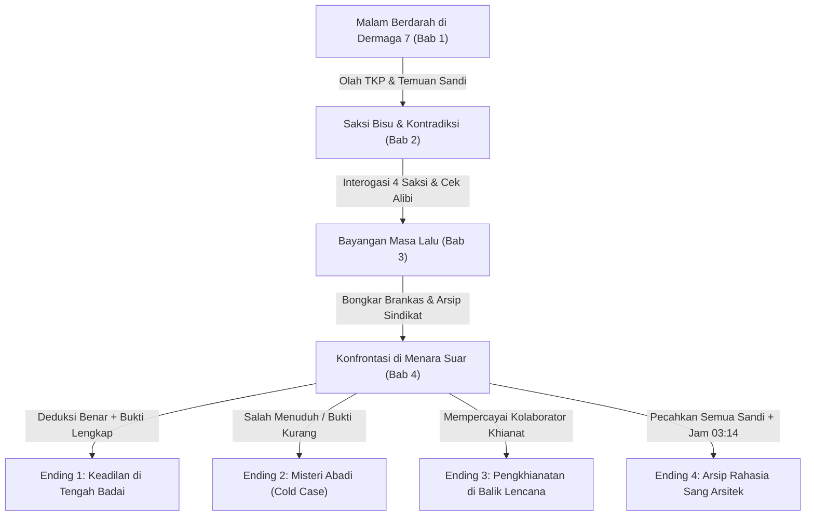

# 🕵️‍♂️ ARALUNA: Arsip Pembunuhan Tak Terpecahkan

<div align="center">


-critical.svg?style=for-the-badge)

-success.svg?style=for-the-badge)
-purple.svg?style=for-the-badge)


**Sebuah Game Visual Novel Detektif Noir Interaktif Berbasis Web dengan Ensiklopedia Terintegrasi 102 Kasus Pembunuhan Nyata yang Belum Terpecahkan di Dunia.**

### 🌐 [**>> KLIK UNTUK MAINKAN LANGSUNG (LIVE DEMO) <<**](https://azyte.github.io/araluna/)

[](https://vercel.com/new/clone?repository-url=https%3A%2F%2Fgithub.com%2FAzyte%2Faraluna)

[🎮 Demo Online](https://azyte.github.io/araluna/) • [📖 Sinopsis](#-sinopsis--latar-cerita) • [⚙️ Arsitektur Teknis](#-arsitektur-teknis-dari-0) • [🧩 Mekanik Game](#-mekanik-game--fitur-utama) • [📂 Database Kasus](#-ensiklopedia-102-kasus-kriminal-dunia) • [🚀 Panduan Deploy](#-panduan-deployment-vercel--github-pages)

</div>

---

## 📑 Daftar Isi
1. [Tentang Game & Sinopsis](#-sinopsis--latar-cerita)
2. [Karakter & Gaya Bahasa](#-karakter--gaya-bicara)
3. [Fitur Utama & Mekanik Permainan](#-mekanik-game--fitur-utama)
   - [Struktur 4 Bab Narasi](#struktur-4-bab-narasi)
   - [4 Multiple Endings](#4-multiple-endings)
   - [3 Teka-Teki Sandi Interaktif (Puzzles)](#3-teka-teki-sandi-interaktif-puzzles)
   - [Buku Catatan, Bukti & Mind Palace Deductions](#buku-catatan-bukti--mind-palace-deductions)
   - [Sistem Save/Load (5 Slot + 1 Autosave) & 12 Checkpoints](#sistem-saveload-5-slot--1-autosave--12-checkpoints)
   - [Mode Timer Tekanan Opsional (15 Menit)](#mode-timer-tekanan-opsional-15-menit)
4. [Sistem Multi-Bahasa (i18n)](#-sistem-multi-bahasa-i18n)
5. [Ensiklopedia 102 Kasus Kriminal Dunia](#-ensiklopedia-102-kasus-kriminal-dunia)
6. [Arsitektur Teknis (Dari 0)](#-arsitektur-teknis-dari-0)
   - [Filosofi Desain Standalone Zero-Dependency](#1-filosofi-desain-standalone-zero-dependency)
   - [Mesin Audio Prosedural (Web Audio API)](#2-mesin-audio-prosedural-web-audio-api)
   - [Sistem Partikel Hujan Canvas 60 FPS](#3-sistem-partikel-hujan-canvas-60-fps)
   - [State Management & Flow Data Reaktif](#4-state-management--flow-data-reaktif)
   - [Struktur File Proyek & Pipeline Kompilasi](#5-struktur-file-proyek--pipeline-kompilasi)
7. [Quick Start & Instalasi](#-quick-start--instalasi)
8. [Cara Menambah Konten & Bahasa Baru](#-cara-menambah-konten--bahasa-baru)
9. [Panduan Deployment (Vercel & GitHub Pages)](#-panduan-deployment-vercel--github-pages)
10. [Etika & Penafian Legal](#-etika--penafian-legal)
11. [Lisensi & Kontribusi](#-lisensi--kontribusi)

---

## 📖 Sinopsis & Latar Cerita

Kota **Araluna** — sebuah kota pelabuhan industrial yang selalu dibasahi hujan dingin tanpa henti, diselimuti bayang-bayang kejahatan terorganisir dan aroma mesiu basi. 

Pemain berperan sebagai **Detektif Arun**, seorang penyidik pembunuhan yang skeptis dan dihantui masa lalunya. Tiga tahun lalu, rekan kerja dan mentornya, **Daniel**, dibunuh secara brutal di tepi Dermaga 7. Kasus itu dibekukan oleh kepolisian karena ketiadaan bukti dan dugaan tekanan dari pihak oligarki kota.

Malam ini, sebuah paket misterius tiba di meja Arun. Di dalamnya terdapat buku catatan bersimbah darah, sebuah arloji saku berukir lambang sindikat yang jarumnya terhenti di pukul 03:14, dan surat bersandi dari figur misterius yang menamai dirinya **"The Archivist"**. 

Untuk mengungkap konspirasi ini, Arun harus kembali ke Dermaga 7, memeriksa tempat kejadian perkara (TKP), menginterogasi para saksi berkepentingan, memecahkan teka-teki sandi kriptografis, dan menghadapi kenyataan pahit di puncak Menara Suar Araluna.



---

## 👥 Karakter & Gaya Bicara

Setiap karakter dirancang memiliki "voice" psikologis yang khas dan konsisten di seluruh 3 pilihan bahasa:

| Karakter | Peran | Persona & Gaya Bicara |
| :--- | :--- | :--- |
| **Detektif Arun** | Protagonis / Pemain | Pendiam, analitis, penuh trauma masa lalu. Gaya bicara datar, sarkastik, namun tajam dan introspektif. |
| **Inspektur Vela** | Atasan di Kepolisian | Skeptis, memegang teguh regulasi tapi diam-diam peduli pada keselamatan Arun. Nada bicara tegas, direct, tanpa basa-basi. |
| **Mira** | Jurnalis Investigasi | Wartawan independen yang meneliti korupsi pelabuhan. Cepat, agresif, skeptis terhadap polisi, penuh pertanyaan jebakan. |
| **Brama** | Adik Korban (Daniel) | Emosional, defensif, merasa ditinggalkan oleh sistem peradilan. Kalimatnya sering patah-patah dan mudah meledak. |
| **Dr. Sena** | Dokter Forensik | Objektif, dingin, terbiasa dengan kematian. Menggunakan terminologi medis presisi yang diselipi humor gelap (*dark humor*). |
| **Reyn** | Pengusaha Pelabuhan | Konglomerat licik dengan jejaring politik dan sindikat hitam. Nada bicara santun, tenang, tapi penuh ancaman terselubung. |
| **"The Archivist"** | Antagonis Misterius | Dalang bayangan yang mengirimkan teka-teki sandi. Bertutur kata puitis, filosofis, enigmatik, memandang kematian sebagai sebuah arsip. |

---

## 🧩 Mekanik Game & Fitur Utama

### Struktur 4 Bab Narasi
1. **Bab 1: Malam Berdarah di Dermaga 7**  
   - Olah TKP di dermaga hujan lebat.
   - Analisis balistik dan temuan kartu tarot bertuliskan sandi Caesar Cipher.
2. **Bab 2: Saksi Bisu & Kontradiksi**  
   - Menginterogasi 4 saksi kunci: *Inspektur Vela, Mira sang Jurnalis, Brama sang Adik, dan Dr. Sena sang Ahli Forensik*.
   - Mengidentifikasi alibi palsu dan kontradiksi kesaksian yang terinspirasi dari pola kasus legendaris *Setagaya* & *Hinterkaifeck*.
3. **Bab 3: Bayangan Masa Lalu**  
   - Memasuki gudang arsip terbengkalai dan membongkar dokumen *cold case* 20 tahun silam.
   - Mengombinasikan bukti kunci dan membuka brankas tersembunyi.
4. **Bab 4: Konfrontasi di Menara Suar**  
   - Menghadapi tersangka utama di tengah badai petir pelabuhan.
   - Menyajikan deduksi akhir berdasarkan kebenaran bukti yang dikumpulkan.

---

### 4 Multiple Endings
Setiap keputusan dan bukti yang dikumpulkan menentukan epilog akhir:
- ⚖️ **Ending 1: Keadilan di Tengah Badai (*Justice Restored*)**  
  Arun berhasil menyusun seluruh mata rantai bukti, menjerat Reyn di pengadilan, dan membongkar identitas The Archivist.
- 🌫️ **Ending 2: Misteri Abadi (*Cold Case Eternity*)**  
  Bukti yang diajukan tidak cukup kuat. Pembunuh sebenarnya lolos ke luar yurisdiksi, meninggalkan Arun dalam penyesalan seumur hidup.
- 🩸 **Ending 3: Pengkhianatan di Balik Lencana (*Internal Betrayal*)**  
  Arun salah menaruh kepercayaan pada jejaring kepolisian yang telah disusupi, berujung pada penyergapan maut di dermaga.
- 🗝️ **Ending 4: Arsip Rahasia Sang Arsitek (*The Architect's True Archive*)**  
  Ending rahasia yang terbuka jika pemain memecahkan ketiga sandi dengan sempurna dan menemukan keterkaitan personal antara Daniel, The Archivist, dan masa kecil Arun sendiri.

---

### 3 Teka-Teki Sandi Interaktif (Puzzles)

Permainan mengintegrasikan mini-game teka-teki langsung di antarmuka web tanpa memuat aset luar:

1. **Cipher Disk Decoder (Caesar Shift Cipher)**  
   Pemain memutar piringan roda sandi untuk menggeser huruf kriptogram yang ditinggalkan The Archivist di kartu tarot TKP.
2. **Brankas Dokumen Sindikat (4-Digit Logic Lock)**  
   Mekanisme keypad digital untuk membuka brankas arsip kuno berdasarkan petunjuk tanggal kasus lama dan hitungan matematika forensik.
3. **Penyelarasan Sirkuit Listrik Menara Suar (Wharf Dials)**  
   Menyelaraskan polaritas 3 dial sirkuit listrik (*Primary, Relai, Output*) untuk memulihkan daya lampu mercusuar sebelum konfrontasi maut.

---

### Buku Catatan, Bukti & Mind Palace Deductions
- **Detective Notebook**: Secara otomatis mencatat setiap temuan petunjuk (*clue*), lengkap dengan bab penemuan dan analisis singkat.
- **Evidence Inventory**: Menyimpan item fisik (*Arloji Rusak, Kartu Tarot Sandi, Sampel Peluru 9mm, Kunci Kantor Gudang*).
- **Mind Palace (Sistem Deduksi)**: Menu khusus yang memungkinkan pemain mengombinasikan dua atau lebih bukti untuk melahirkan hipotesis baru yang membuka opsi dialog tersembunyi.

---

### Sistem Save/Load (5 Slot + 1 Autosave) & 12 Checkpoints
- **5 Slot Simpan Manual + 1 Slot Autosave Otomatis**:  
  Setiap slot menyimpan status bab, scene saat ini, seluruh petunjuk yang terbuka, inventory barang bukti, flag dialog moral, waktu bermain (*timestamp*), serta preferensi bahasa.
- **12 Checkpoint Naratif**:  
  Titik pemulihan instan sebelum keputusan krusial, sebelum interogasi, dan sesudah puzzle. Pemain dapat melakukan *Quick Reload* langsung dari menu dalam game dengan toast notifikasi visual *"Checkpoint Tersimpan"*.

---

### Mode Timer Tekanan Opsional (15 Menit)
Bagi pemain yang menginginkan ketegangan ala film thriller investigasi, tersedia **Pressure Timer Mode** (15:00 menit) yang dapat diaktifkan di menu Pengaturan. Timer akan terus menghitung mundur selama proses interogasi dan olah TKP, memaksa pemain mengambil keputusan cepat di bawah tekanan.

---

## 🌐 Sistem Multi-Bahasa (i18n)

Game ini mendukung **3 mode bahasa** yang dapat diganti secara instan kapan saja tanpa me-reload halaman:

1. 🇮🇩 **Bahasa Indonesia Baku (`id`)**:  
   Gaya sastra noir formal, mendalam, dan atmosferik. Cocok untuk pengalaman naratif klasik.
2. 🕶️ **Bahasa Indonesia Gaul / Jakarta Slang (`id_gaul`)**:  
   Menggunakan ragam cakap urban (*"Gue/Lu"*, sarkasme natural, ceplas-ceplos). Didesain agar dialog terasa sangat hidup dan manusiawi seperti percakapan nyata di lapangan, bukan terjemahan kaku.
3. 🇬🇧 **English Hard-Boiled Noir (`en`)**:  
   Gaya prosa detektif hard-boiled klasik ala Raymond Chandler dan Dashiell Hammett.

---

## 📂 Ensiklopedia 102 Kasus Kriminal Dunia

Araluna dilengkapi dengan fitur **Case Library (Ruang Arsip Kriminologi)** yang memuat **102 kasus pembunuhan nyata yang belum terpecahkan (*unsolved cold cases*)** dari seluruh dunia.

```
📁 Case Library Overview (102 Kasus Terverifikasi)
├── 🌏 Asia (20 Kasus)           : Setagaya, Akseyna, Setiabudi 13, Marsinah, Kasus Dukun AS, Kasus Udin...
├── 🏰 Eropa (35 Kasus)          : Jack the Ripper, Hinterkaifeck, Monster of Florence, Olof Palme, Boy in the Box...
├── 🗽 Amerika Utara (30 Kasus)  : Black Dahlia, Zodiac Killer, JonBenét Ramsey, Tylenol Murders, D.B. Cooper...
├── 🦘 Oseania & Pasifik (10 Kasus): Tamam Shud (Somerton Man), Beaumont Children, Wanda Beach, Mr. Cruel...
└── 🌍 Afrika & Amerika Latin (7 Kasus): The Torso in the Thames, Alto Hospicio, Babysitter Killer...
```

Setiap entri kasus mencakup:
- **Nama Kasus & Tahun Kejadian**
- **Lokasi Geografis & Benua**
- **Ringkasan Kronologi & Korban**
- **Teori & Tersangka Utama**
- **Status Penyelidikan Terkini**
- **Inspirasi Mekanik Game** (bagaimana kasus tersebut menginspirasi teka-teki, alibi saksi, atau plot twist dalam Araluna).
- **Label Verifikasi**: Ditandai secara transparan sebagai *"Sumber: Berdasarkan catatan historis kriminologi publik"*.

---

## ⚙️ Arsitektur Teknis (Dari 0)

Proyek ini dibangun dari dasar dengan filosofi ketahanan jangka panjang, kemudahan portabilitas, dan performa tinggi tanpa ketergantungan framework pihak ketiga (*Zero External Dependencies*).

```
D:\webgame\Case\
├── index.html               # Game Final Standalone (HTML5 + CSS + JS + 102 Kasus) [~295 KB]
├── cases_data.json          # Database 102 Kasus Kriminal Dunia (Format JSON Murni)
├── engine_data.js           # Modul 1: Kamus I18N (id, id_gaul, en) & Aturan Deduksi
├── engine_story.js          # Modul 2: Story Graph, Dialogue Tree, 4 Bab & 4 Endings
├── engine_core.js           # Modul 3: Web Audio Synth, Canvas Hujan, Puzzles, Save System
├── template.html            # Cetak Biru DOM & Shell Antarmuka Noir
├── build_full_engine.cjs    # Compiler Otomatis (Menggabungkan Modul ke index.html)
├── verify_final_game.cjs    # Automated Test & Verification Suite
├── vercel.json              # Konfigurasi Optimasi Static Hosting Vercel
└── package.json             # Metadata Proyek & NPM Scripts
```

### 1. Filosofi Desain Standalone Zero-Dependency
- **Satu File Siap Jalan**: Seluruh aplikasi game terdistribusi dalam satu file `index.html` utuh (~295 KB).
- **Bisa Dimainkan Offline**: Tidak membutuhkan koneksi internet, CDN font, atau server backend. Cukup *double-click* file `index.html` pada browser apa pun.
- **Performa Instan**: Waktu pemuatan awal (First Contentful Paint) < 50ms karena tidak ada proses parsing bundle React/Webpack yang berat.

---

### 2. Mesin Audio Prosedural (Web Audio API)
Alih-alih mengunduh berkas audio berukuran puluhan megabyte (MP3/OGG), game ini memanfaatkan **Web Audio API** bawaan browser untuk mensintesis seluruh efek suara (*SFX*) dan latar musik (*BGM*) secara matematis waktu-nyata (*real-time synthesis*):

- **Noir Ambient Piano Loop**: Menggunakan osilator harmonik (`triangle` & `sine`) dengan filter *low-pass* dan kurva *exponential decay* yang memainkan progresi akor jazz noir minor:
  $$\text{Fm9} \longrightarrow \text{B}\flat\text{m7} \longrightarrow \text{E}\flat7 \longrightarrow \text{A}\flat\text{maj7}$$
- **Hujan & Petir Prosedural**: Pembangkitan *white noise buffer* yang disaring dengan *biquad filter bandpass* dan modulasi *random gain* untuk mensimulasikan gemuruh petir di kejauhan.
- **SFX Typewriter & Interaksi**: Sintesis frekuensi klik mekanik saat teks dialog berjalan, detak jam, klik tombol, hingga dengung alarm brankas.

---

### 3. Sistem Partikel Hujan Canvas 60 FPS
Pada latar belakang visual, terdapat elemen `<canvas>` dinamis yang merender 120+ partikel tetesan hujan:
- Dilengkapi kalkulasi vektor gravitasi, pergeseran sudut akibat angin pelabuhan (*wind drift*), dan animasi riak air (*splash ripple*) saat partikel menyentuh dasar layar.
- Menggunakan `window.requestAnimationFrame` yang dioptimasi untuk berjalan lancar pada 60 FPS di perangkat low-end maupun layar 144Hz.

---

### 4. State Management & Flow Data Reaktif
Semua logika permainan dikendalikan oleh objek negara pusat (`gameState`):

```javascript
const gameState = {
  playerName: "Arun",
  language: "id", // 'id' | 'id_gaul' | 'en'
  currentChapter: 1,
  currentSceneId: "c1_start",
  inventory: [],
  clues: [],
  flags: {}, // Menyimpan keputusan pemain (misal: mira_trusted, sena_autopsy_read)
  history: [],
  soundMuted: false,
  timerEnabled: false,
  timerRemainingSeconds: 900
};
```

Setiap perubahan scene memicu pembaruan DOM otomatis, memeriksa pemenuhan syarat (*prerequisite clues*) untuk pilihan dialog, serta mengevaluasi status checkpoint secara aman dengan validasi `localStorage`.

---

### 5. Struktur File Proyek & Pipeline Kompilasi
Untuk mempermudah pemeliharaan kode (maintainability), kode sumber dipecah menjadi modul-modul logis:
1. `engine_data.js`: Seluruh kamus bahasa dan metadata petunjuk.
2. `engine_story.js`: Struktur pohon dialog bercabang dan logika transisi adegan.
3. `engine_core.js`: Mesin audio, engine puzzle, manajemen save/load, dan rendering UI.
4. `build_full_engine.cjs`: Skrip pembangun yang membaca modul-modul di atas, menyuntikkan 102 kasus dari `cases_data.json`, melakukan pengujian sintaksis AST murni, dan menghasilkan berkas final `index.html`.

---

## 🎮 Quick Start & Instalasi

### Opsi 1: Jalankan Langsung Tanpa Instalasi
Cukup buka berkas `index.html` menggunakan browser modern pilihan Anda:
```bash
# Windows
start index.html

# macOS
open index.html

# Linux
xdg-open index.html
```

### Opsi 2: Menjalankan via Local HTTP Server
Jika Anda ingin menjalankannya di lingkungan lokal developer:
```bash
# Clone repository
git clone https://github.com/Azyte/araluna.git
cd araluna

# Jalankan server lokal instan (Node.js)
npx serve .
# atau menggunakan Python:
python -m http.server 8080
```
Buka browser dan akses alamat `http://localhost:3000` (atau port yang tertera).

### Opsi 3: Verifikasi Integritas Game
Untuk memvalidasi bahwa seluruh fungsi, karakter, adegan, dan 102 kasus terpasang tanpa eror:
```bash
npm run verify
```

---

## 🛠️ Cara Menambah Konten & Bahasa Baru

### Menambahkan Bahasa Baru
Buka file `engine_data.js` dan tambahkan kode bahasa baru ke dalam objek `I18N`:
```javascript
// Contoh menambah bahasa Jepang (ja)
I18N.ja = {
  ui: {
    start: "調査を開始する",
    notebook: "捜査手帳",
    inventory: "証拠品一覧",
    caseLibrary: "未解決事件記録"
  }
};
```
Kemudian jalankan kompilasi ulang:
```bash
npm run build
```

### Menambahkan Kasus Baru ke Ensiklopedia
Cukup tambahkan objek kasus baru ke dalam berkas `cases_data.json`:
```json
{
  "id": "CASE_103",
  "name": "Misteri Peti Kayu Pelabuhan",
  "year": 1968,
  "continent": "Asia",
  "country": "Indonesia",
  "summary": "Penemuan peti kayu tak berlabel di gudang tua dermaga.",
  "suspects": "Tidak diketahui",
  "status": "Unsolved",
  "game_mechanic_note": "Inspirasi untuk puzzle brankas bab 3."
}
```
Lalu jalankan `npm run build` untuk mengompilasi `index.html` terbaru.

---

## 🚀 Panduan Deployment (Vercel & GitHub Pages)

### Deployment ke Vercel (Rekomendasi)

Repository ini telah dilengkapi berkas `vercel.json` untuk konfigurasi *static hosting zero-configuration*.

#### Cara 1: Menggunakan Vercel Dashboard (1-Click Git Import)
1. Buka [Vercel Dashboard](https://vercel.com/new).
2. Pilih opsi **Import Git Repository**.
3. Pilih repository `Azyte/araluna`.
4. Pada bagian **Build & Development Settings**, biarkan default (Framework Preset: *Other*).
5. Klik **Deploy**. Game akan langsung tayang dengan domain publik `*.vercel.app` dalam hitungan detik.

#### Cara 2: Menggunakan Vercel CLI
```bash
npm install -g vercel
vercel login
vercel --prod
```

---

### Deployment ke GitHub Pages
1. Masuk ke tab **Settings** di repository GitHub Anda (`Azyte/araluna`).
2. Pilih menu **Pages** di bilah navigasi kiri.
3. Pada bagian **Build and deployment > Source**, pilih `Deploy from a branch`.
4. Pilih branch `main` dan folder `/ (root)`.
5. Klik **Save**. Game Anda akan aktif di `https://azyte.github.io/araluna/`.

---

## ⚖️ Etika & Penafian Legal

1. **Karakter & Cerita Fiktif**:  
   Semua karakter utama dalam narasi permainan (*Detektif Arun, Daniel, Vela, Mira, Brama, Dr. Sena, Reyn, The Archivist*) serta institusi dan kejadian di Kota Araluna adalah **murni karya fiksi**. Kesamaan nama atau latar belakang dengan tokoh nyata adalah kebetulan belaka.
2. **Penghormatan terhadap Kasus Nyata**:  
   Database 102 kasus pembunuhan yang belum terpecahkan disajikan murni untuk **tujuan edukatif, dokumentasi sejarah kriminologi, dan kesadaran publik**, tanpa mengeksploitasi penderitaan korban atau keluarga.
3. **Bebas Kekerasan Grafis**:  
   Permainan berfokus pada deduksi intelektual, pemecahan teka-teki logika, dan estetika noir, bukan sensasi kekerasan visual eksplisit.

---

## 📄 Lisensi & Kontribusi

Proyek ini dirilis di bawah lisensi terbuka [MIT License](LICENSE). Anda bebas mempelajari kode sumber, memodifikasi alur narasi, atau mengembangkan modul bahasa baru.

Jika Anda menemukan inkonsistensi data historis atau ingin mengajukan saran penambahan kasus kriminologi, silakan buat *Pull Request* atau buka *Issue* di repositori ini.

---

<div align="center">

*Didedikasikan untuk para pencari kebenaran dan pecinta misteri detektif di seluruh dunia.*  
**ARALUNA © 2026 — Dibuat dengan presisi oleh Azyte.**

</div>

